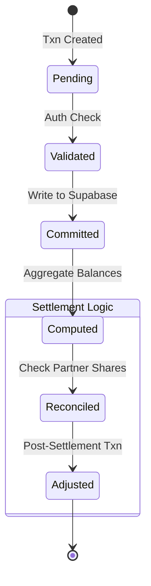

# README.md

> Documentation using **cloudflare-workers** (124 lines).

## 📋 Metadata

| Property | Value |
|----------|-------|
| **Path** | `chitragupta/README.md` |
| **Role** | docs |
| **Language** | markdown |
| **Frameworks** | cloudflare-workers |
| **Lines** | 124 |
| **Size** | 4172 bytes |
| **Modified** | 2026-04-09 14:38 |

## 🔗 Related Files

—

## 📄 Content

```markdown
# Chitragupta — Financial Settlement Engine

**Chitragupta** is the high-fidelity financial ledger for business partnerships. It provides an automated, emerald-accented command center for tracking shared investments, daily sales revenue, and profit settlements.

---

## What's New (April 2026)

| Feature | Description |
|---------|-------------|
| **Ledger Console** | Clean, professional UI driven by Inter and JetBrains Mono |
| **Atomic Settlement** | One-click balancing of partner investments vs. withdrawals |
| **Revenue Stream** | Real-time transaction categories (Income, Expense, Capital) |
| **Partner Mesh** | Multi-partner ownership split with automated sharing logic |
| **PWA Native** | Installable offline-first ledger with service workers |

---

## Architecture: Transaction Lifecycle & State



---

## 🚀 Deployment Guide

**Chitragupta**
> **"Professional Settlement Hub" (Internal ID)** — Comprehensive ledger & accounting system.

Deploy the **Chitragupta** settlement engine to Cloudflare Pages:

### Configuration Settings
| Setting | Value |
|---------|-------|
| **Project Name** | `chitragupta` |
| **Framework Preset** | `None` |
| **Build Command** | `npm run build` |
| **Build Output Directory** | `dist` |
| **Root Directory** | `/` |
| **Compatibility Date** | `2024-11-05` |

### Required Environment Variables (Critical)
> [!IMPORTANT]
> Configure these in Cloudflare **Settings > Functions > Environment Variables**. Without these, the ledger will fail to connect to your database.

| Secret | Mandatory | Purpose |
|---|---|---|
| `SUPABASE_URL` | **Yes** | Your dedicated Supabase Project URL |
| `SUPABASE_ANON_KEY` | **Yes** | Public API key (Vault-guarded) |
| `SUPABASE_SERVICE_ROLE_KEY` | **Yes** | Admin key for settlement overrides |
| `SUPABASE_SCHEMA` | No | Default: `chitragupta` (Recommended) |

### Functional Bindings (Identity Logic)
Create this in **Settings > Functions > Bindings**:
- **KV Namespace**: `AUTH_KEYS`
  > This is required for the **Zero-Touch Asymmetric Auth** system to store encryption keys.
| `SUPABASE_SCHEMA` | Database schema (default: `chitragupta`) |
| `JWT_SECRET` | Secret for signing access tokens |
| `JWT_REFRESH_SECRET` | Secret for signing long-lived refresh tokens |
| `ALLOWED_ORIGINS` | Comma-separated list for CORS (e.g., `https://kanak.pages.dev`) |

---

## 🔐 Zero-Touch Security Upgrade (Asymmetric EdDSA)
Chitragupta now features an automated, zero-disruption security system that replaces manual `JWT_SECRET` rotation.

### 1. Functional Bindings (Required)
To enable auto-rotation at **Zero Cost**, you must create a KV Namespace in the Cloudflare Dashboard:
- **Namespace Name**: `AUTH_KEYS`
- **Variable Name**: `AUTH_KEYS`

### 2. Automated Rotation
- **Frequency**: Every 90 Days.
- **Grace Period**: 24 Hours (Old keys remain valid for active sessions).
- **Manual Trigger**: `npx wrangler scheduled --env production` (For testing).

### 3. Public Key Discovery
Your other services (Vishwakarma, Kanak, Indra) can now verify tokens without sharing secrets by fetching your Public Key Set:
- **JWKS URL**: `https://chitragupta.pages.dev/.well-known/jwks.json`

---

## 🛠️ Operational Tasks

```bash
# Install dependencies
npm install

# Local Development
npm run dev

# Production Build
npm run build

# Direct Deployment
npm run deploy
```

## 📂 Structure
- `/pages/_worker.js`: The core API logic and routing.
- `/docs`: Detailed API reference and deployment guides.
- `/wrangler.toml`: Cloudflare deployment configuration.

## 🚦 Getting Started
1.  **Install Dependencies**: `npm install`
2.  **Local Dev**: `npx wrangler dev`
3.  **Deploy**: `npx wrangler deploy`

## 📖 Documentation
- [API Endpoints](docs/API_ENDPOINTS.md)
- [Deployment Guide](docs/DEPLOYMENT.md)

```
