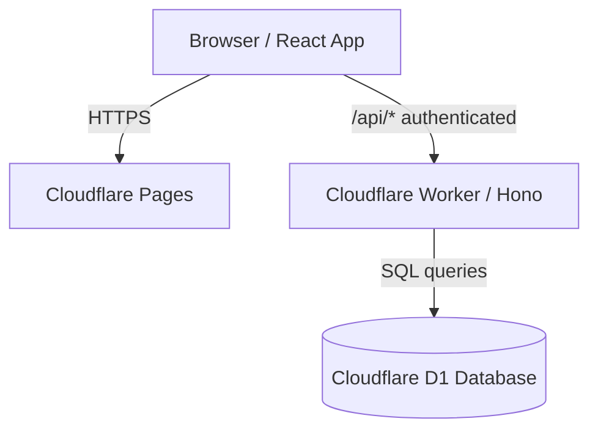

# GUIDE.md

> Documentation using **cloudflare-workers, docker, vite** (223 lines).

## 📋 Metadata

| Property | Value |
|----------|-------|
| **Path** | `social-blueprint-ai/GUIDE.md` |
| **Role** | docs |
| **Language** | markdown |
| **Frameworks** | cloudflare-workers, docker, vite |
| **Lines** | 223 |
| **Size** | 6519 bytes |
| **Modified** | 2026-04-09 15:18 |

## 🔗 Related Files

—

## 📄 Content

```markdown
# Cloudflare Deployment Guide

This guide walks you through deploying Social Blueprint AI using Cloudflare Pages for the frontend and a dedicated Cloudflare Worker for the backend API.

## Architecture



## Prerequisites

- [Node.js 20+](https://nodejs.org/)
- A [Cloudflare account](https://dash.cloudflare.com/sign-up) (free tier is sufficient)
- Wrangler CLI: `npm install -g wrangler`
- A [Google AI Studio API key](https://aistudio.google.com/apikey) for Gemini

---

## Step 1 — Authenticate with Cloudflare

```bash
wrangler login
```

This opens a browser window to authorize Wrangler to your Cloudflare account.

---

## Step 2 — Create the D1 Database

```bash
wrangler d1 create social-blueprint-db
```

Copy the `database_id` from the output, then open `worker/wrangler.toml` and replace the placeholder:

```toml
[[d1_databases]]
binding = "DB"
database_name = "social-blueprint-db"
database_id = "YOUR_D1_DATABASE_ID"   # <-- replace this
```

---

## Step 3 — Run Database Migrations

```bash
cd worker
wrangler d1 execute social-blueprint-db --file=./schema.sql --remote
```

This creates the `users`, `profiles`, and `audits` tables in your D1 database.

---

## Step 4 — Set Worker Secrets

Set the secrets that the Worker needs at runtime:

```bash
# Required: Google Gemini API key
wrangler secret put GEMINI_API_KEY

# Required: Frontend URL for CORS (set after Pages deploy, or use * for testing)
wrangler secret put APP_URL

# Optional: Stripe secret key for subscription payments
wrangler secret put STRIPE_SECRET_KEY
```

Each command will prompt you to paste the value.

---

## Step 4b — Set up Google OAuth (Optional)

To enable "Sign in with Google", you need to create OAuth 2.0 credentials in the Google Cloud Console.

1. Go to the [Google Cloud Console](https://console.cloud.google.com/).
2. Navigate to **APIs & Services → Credentials**.
3. Click **Create Credentials → OAuth client ID**. (If requested, configure the OAuth consent screen first).
4. Set Application type to **Web application**.
5. Add your application's API URL to the **Authorized redirect URIs**.
   - Note: The URI must end with exactly `/api/auth/google/callback`.
   - Example if using Pages Functions: `https://social-blueprint-ai.pages.dev/api/auth/google/callback`
   - Example if using raw Worker: `https://social-blueprint-worker.<your-subdomain>.workers.dev/api/auth/google/callback`
6. Click **Create** and copy the Client ID and Client Secret.

Set them in your Worker credentials:
```bash
wrangler secret put GOOGLE_CLIENT_ID
wrangler secret put GOOGLE_CLIENT_SECRET
```

---

## Step 5 — Deploy the Worker

```bash
cd worker
npm install
wrangler deploy
```

Note the Worker URL from the output — it looks like:
`https://social-blueprint-worker.<your-subdomain>.workers.dev`

---

## Step 6 — Build and Deploy the Frontend

From the project root:

```bash
VITE_API_URL=https://social-blueprint-worker.<your-subdomain>.workers.dev npm run build
```

Then create a Cloudflare Pages project and deploy:

```bash
wrangler pages project create social-blueprint-ai
wrangler pages deploy dist --project-name=social-blueprint-ai
```

Note the Pages URL — it looks like:
`https://social-blueprint-ai.pages.dev`

---

## Step 7 — Update the APP_URL Secret

Now that you have the Pages URL, update the Worker's `APP_URL` secret so CORS is scoped correctly:

```bash
cd worker
wrangler secret put APP_URL
# paste: https://social-blueprint-ai.pages.dev
```

---

## Step 8 — Set Up GitHub Actions (optional, for CI/CD)

Add the following secrets to your GitHub repository
(**Settings → Secrets and variables → Actions**):

| Secret                  | Value                                          |
|-------------------------|------------------------------------------------|
| `CLOUDFLARE_API_TOKEN`  | API token with Pages + Workers + D1 edit perms |
| `CLOUDFLARE_ACCOUNT_ID` | Your Cloudflare Account ID                     |
| `CLOUDFLARE_WORKER_URL` | Worker URL from Step 5                         |

Every push to `main` will now automatically:
1. Run D1 migrations
2. Deploy the Worker
3. Build the frontend with the correct `VITE_API_URL`
4. Deploy the frontend to Pages

### Creating a scoped Cloudflare API token

1. Go to [Cloudflare API Tokens](https://dash.cloudflare.com/profile/api-tokens)
2. Click **Create Token → Custom Token**
3. Add these permissions:
   - **Account → Cloudflare Pages → Edit**
   - **Account → Workers Scripts → Edit**
   - **Account → D1 → Edit**
4. Set **Account Resources → Include → your account**
5. Click **Continue to summary → Create Token**

---

## Step 9 — Verify the Deployment

1. Open your Pages URL: `https://social-blueprint-ai.pages.dev`
2. Sign in with the demo credentials
3. Add a profile and run an AI audit to confirm end-to-end connectivity

---

## Updating the Deployment

| What changed     | Command                                      |
|------------------|----------------------------------------------|
| Frontend only    | `npm run build && wrangler pages deploy dist` |
| Worker only      | `cd worker && wrangler deploy`               |
| Schema changes   | `cd worker && wrangler d1 execute social-blueprint-db --file=./schema.sql --remote` |
| Secrets          | `cd worker && wrangler secret put <NAME>`    |

Or just push to `main` — the GitHub Actions workflow handles all of the above automatically.

---

## Free Tier Limits

| Resource        | Free limit               |
|-----------------|--------------------------|
| Pages builds    | 500 builds/month         |
| Workers requests| 100,000 requests/day     |
| D1 reads        | 5,000,000 reads/day      |
| D1 writes       | 100,000 writes/day       |

Social Blueprint AI comfortably fits within the free tier for personal or small-team use.

---

## Troubleshooting

**CORS errors in the browser**
Make sure `APP_URL` Worker secret matches your Pages domain exactly (no trailing slash).

**`YOUR_D1_DATABASE_ID` not replaced**
Open `worker/wrangler.toml` and paste the `database_id` from Step 2.

**Gemini API errors**
Verify `GEMINI_API_KEY` is set: `wrangler secret list` (inside `worker/`).

**Worker 500 on `/api/profiles`**
Run migrations again (Step 3) — the database tables may not exist yet.

```
