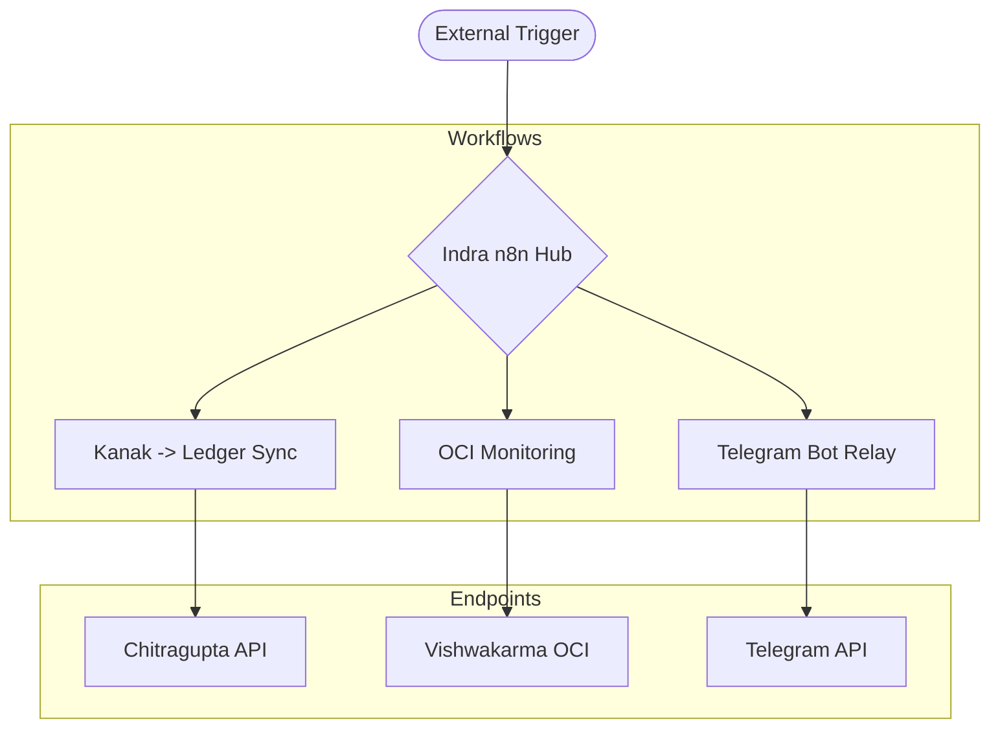

# README.md

> Documentation (79 lines).

## 📋 Metadata

| Property | Value |
|----------|-------|
| **Path** | `indra/README.md` |
| **Role** | docs |
| **Language** | markdown |
| **Frameworks** | — |
| **Lines** | 79 |
| **Size** | 2947 bytes |
| **Modified** | 2026-04-07 14:13 |

## 🔗 Related Files

—

## 📄 Content

```markdown
# Indra — Automation Mesh & Integration Engine

**Indra** is the high-performance automation backbone for the ecosystem. Powered by **n8n**, it orchestrates complex multi-service workflows, webhook triggers, and real-time state synchronization across all business units.

---

## 🏗️ Architecture: The Automation Hub

Indra acts as the "Central Nervous System" that connects your disparate services into a cohesive, automated platform.



---

## 🚀 Deployment Guide (Render & Docker)

Indra is designed to run as a sovereign Docker container, ideally on **Render** for high availability.

### 1. Render Dashboard Setup
| Setting | Value |
| :--- | :--- |
| **Service Type** | `Web Service` |
| **Runtime** | `Docker` |
| **Plan** | `Starter (Recommended)` |
| **Region** | `Oregon (or preferred)` |

### 2. Required Environment Variables (Secrets)
> [!IMPORTANT]
> To protect your infrastructure, these secrets should **never** be hardcoded. Configure them in the **Environment** tab of your Render dashboard.

| Secret Name | Purpose | Source |
| :--- | :--- | :--- |
| `N8N_ENCRYPTION_KEY` | **Critical**: Encrypts your credentials. | Generate a 32-character string |
| `N8N_SOURCECONTROL_HTTPS_TOKEN` | GitHub PAT for workflow syncing. | GitHub Developer Settings |
| `DB_POSTGRESDB_PASSWORD` | Supabase Password for n8n storage. | Supabase Dashboard |
| `WEBHOOK_URL` | Your instance URL (e.g., `https://indra.onrender.com/`) | Render Dashboard |

---

## 🔐 Security & Rotation Guide
To maintain enterprise-grade security, we recommend rotating your automation secrets every **90 days**.

### 1. GitHub Personal Access Token (PAT)
- **Where to rotate**: GitHub → Settings → Developer Settings → Tokens (Classic).
- **Required Scopes**: `repo`, `workflow`.
- **Update**: Update the `N8N_SOURCECONTROL_HTTPS_TOKEN` in Render.

### 2. Zero-Touch Asymmetric Auth (New)
Indra workflows can now authenticate securely with Chitragupta using the **JWKS (JSON Web Key Set)** endpoint. This eliminates the need for shared `JWT_SECRET` strings.
- **Discovery URL**: `https://chitragupta.pages.dev/.well-known/jwks.json`
- **Algorithm**: `Ed25519 (EdDSA)`

### 2. Database Password
- **Where to rotate**: Supabase Dashboard → Settings → Database → Reset Password.
- **Update**: Update the `DB_POSTGRESDB_PASSWORD` in Render.

---

## 🚦 Keep-Alive Logic
The included GitHub Action (`indra-keep-alive.yml`) pings your instance every 7 minutes to ensure the Render free tier remains responsive 24/7.

---

*Indra — Vishwakarma Platform*

```
