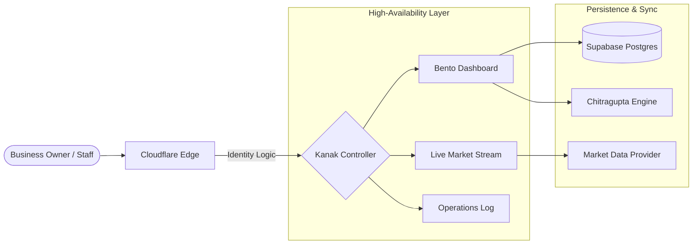

# README.md

> Documentation using **cloudflare-workers** (94 lines).

## 📋 Metadata

| Property | Value |
|----------|-------|
| **Path** | `kanak/README.md` |
| **Role** | docs |
| **Language** | markdown |
| **Frameworks** | cloudflare-workers |
| **Lines** | 94 |
| **Size** | 3075 bytes |
| **Modified** | 2026-04-07 12:24 |

## 🔗 Related Files

—

## 📄 Content

```markdown
# Kanak — Business Intelligence & Control Hub

**Kanak** is the high-performance SaaS control plane for modern retail and enterprise management. It provides a real-time, bento-inspired dashboard for inventory orchestration, market-rate monitoring, and financial settlement.

---

## What's New (April 2026)

| Feature | Description |
|---------|-------------|
| **Executive Bento Dash** | High-fidelity, responsive UI with glassmorphism and depth |
| **Market-Ref Pulse** | Real-time commodity tracking (24K/22K Gold, Silver) |
| **Atomic Inventory** | One-click stock updates, SKU tracking, and supply chain logs |
| **SaaS Command Center** | Multi-tenant identity logic with role-based access control |
| **Shield Auth** | Supabase-native authentication with enterprise-grade session guards |

---

## Architecture: Multi-tenant SaaS Topology



---

## 🚀 Deployment Guide (Production-Grade)

Deploy **Kanak** to Cloudflare Pages with the following enterprise settings:

### Cloudflare Dashboard Configuration
| Setting | Value |
|---------|-------|
| **Project Name** | `kanak` |
| **Framework Preset** | `None` |
| **Build Command** | `None` |
| **Build Output Directory** | `pages` |
| **Compatibility Date** | `2024-11-05` |
| **Compatibility Flags** | `nodejs_compat` |

### Required Environment Variables (Secrets)
> [!IMPORTANT]
> Configure these in Cloudflare **Settings > Functions > Environment Variables** to enable secure database and AI orchestration.

| Secret | Purpose |
|---|---|
| `SUPABASE_URL` | Your dedicated Supabase Project URL |
| `SUPABASE_KEY` | **Service Role Secret** (Required for proxy/admin) |
| `DATABASE_URL` | **(Optional)** Direct Postgres connection for migrations |
| `GROQ_API_KEY` | API Key for AI-powered business insights (Llama-3) |
| `TELEGRAM_BOT_TOKEN` | Token for the Kanak notification bot |
| `TELEGRAM_CHAT_ID` | Goal chat ID for executive alerts |

### Cloudflare Bindings (Hardware Logic)
> [!TIP]
> These bindings must be created in the **Settings > Functions > Bindings** section of your Cloudflare Pages dashboard.

| Type | Name | Purpose |
|---|---|---|
| **KV Namespace** | `RATE_LIMIT_KV` | Anti-brute-force rate limiting for the login portal |

---

## 📂 Repository Structure

- `/pages`: The primary dashboard interface (Static UI + High-End Glass CSS).
- `/functions`: Edge-native backends for market syncing and auth hooks.
- `/docs`: Detailed operational and architectural guides.

---

## 🛠️ Operational Tasks

```bash
# Preview Local Instance
npm run dev

# Push Global Update
npx wrangler pages deploy pages
```

```
