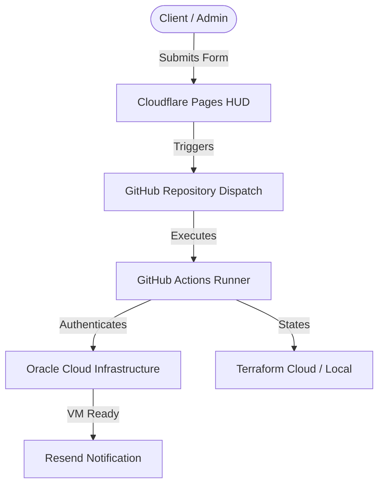

# README.md

> Documentation using **cloudflare-workers, docker, typescript** (127 lines).

## 📋 Metadata

| Property | Value |
|----------|-------|
| **Path** | `vishwakarma/README.md` |
| **Role** | docs |
| **Language** | markdown |
| **Frameworks** | cloudflare-workers, docker, typescript |
| **Lines** | 127 |
| **Size** | 5078 bytes |
| **Modified** | 2026-04-07 14:56 |

## 🔗 Related Files

—

## 📄 Content

```markdown
# Vishwakarma — One-Click Cloud Provisioning

**Vishwakarma** is a simplified provisioning portal for non-technical users. It enables a "Guided Form" workflow where clients can request cloud resources with a single click, while the backend handles all the complex Terraform and OCI orchestration automatically.

---

## 🏗️ The "Simplicity Bridge" Architecture

Vishwakarma acts as a friendly interface that bridges the gap between your needs and advanced infrastructure automation.

---

## 🔐 Automated Maintenance (Embedded)
To ensure your infrastructure remains efficient and secure, Vishwakarma includes automated background maintenance:

### 1. Zero-Touch Cloudflare Cleanup
The included GitHub Action (`cloudflare-cleanup.yml`) runs daily at 1 AM. It is **completely embedded** and maintenance-free.
- **Action**: Purges old "Preview" deployments while protecting your Production site.
- **Storage**: Keeps your Cloudflare account clean without any manual effort.

### 2. Personal Access Token (PAT)
If you need to rotate your GitHub Token:
- **Where**: GitHub Settings → Developer Settings.
- **Update**: Update the `GH_TOKEN` in Cloudflare Pages Variables.



---

## 🚀 Setup Pillar 1: GitHub (The Engine)
> [!IMPORTANT]
> These secrets must be configured in your **GitHub Repository** under **Settings > Secrets and variables > Actions**. They allow your automation engine to build real-world infrastructure.

| Secret Name | Purpose |
| :--- | :--- |
| `OCI_TENANCY_OCID` | Your OCI Tenancy root ID |
| `OCI_USER_OCID` | OCI IAM User ID with provisioning rights |
| `OCI_FINGERPRINT` | API Key Fingerprint for your OCI account |
| `OCI_PRIVATE_KEY` | Your OCI Private Key (Complete PEM format) |
| `CLOUDFLARE_API_TOKEN` | Token for DNS/Pages management (Cleanups) |
| `TAILSCALE_AUTH_KEY` | Key to auto-join new nodes to your mesh network |
| `TF_API_TOKEN` | (Optional) For remote Terraform state management |

---

## 🚀 Setup Pillar 2: Cloudflare (The Interface)
> [!TIP]
> These must be configured in the **Cloudflare Pages Dashboard** under **Settings > Functions**. They power the AI guidance and notification engine.

### 1. Environment Variables & Secrets
| Secret Name | Purpose | Source |
| :--- | :--- | :--- |
| `GH_TOKEN` | Your GitHub PAT (Classic) | GitHub Developer Settings |
| `RESEND_API_KEY` | For "Deployment Complete" emails | resend.com |
| `GROQ_API_KEY` | High-speed LLM for Brahma AI | console.groq.com |
| `PRIMARY_MODEL` | Default AI model | `@cf/meta/llama-3.1-8b-instruct` |

### 2. Functional Bindings (Hardware Logic)
Create these in **Settings > Functions > Bindings**:
- **KV Namespace**: `RESOURCES` (Client & Session store)
- **KV Namespace**: `KV_AGENT_MEMORY` (AI context persistence)
- **Workers AI**: `AI` (Native edge inference)

---

## 🛠️ Deployment Instructions

1.  **Repository Setup**:
    -   Ensure this folder is initialized as its own repository.
    -   Set your production remote: `git remote add origin [URL]`

2.  **Pages Deployment**:
    -   **Project Name**: `vishwakarma`
    -   **Build Output Directory**: `pages`
    -   **Compatibility Flags**: `nodejs_compat`

3.  **Local Testing**:
    ```bash
    npx wrangler pages dev pages
    ```

---

## 📂 Available Services

### **Standard Server Stack**
- [x] **Nextcloud**: Private collaboration & storage.
- [x] **Pi-hole**: Network-wide ad blocking.
- [x] **Vaultwarden**: Self-hosted password management.
- [x] **n8n**: Workflow automation.

### **Serverless Edge Stack**
- [x] **NextDNS**: Cloud-based DNS filtering.
- [x] **Tailscale**: Encrypted mesh VPN.
- [x] **Cloudflare Zero Trust**: Enterprise-grade security.

---

## 🔐 Security & Rotation Guide
To maintain enterprise-grade security, we recommend rotating your orchestration secrets every **90 days**.

### 1. GitHub Personal Access Token (PAT)
- **Where to rotate**: GitHub → Settings → Developer Settings → Personal Access Tokens (Classic).
- **Required Scopes**: `repo`, `workflow`.
- **Update**: In **Cloudflare Pages Settings > Functions > Variables**, update the `GH_TOKEN` secret.

### 2. Zero-Touch Asymmetric Auth (New)
Vishwakarma can now verify tokens securely from the central **Identity Hub (Chitragupta)** using the JWKS endpoint.
- **Discovery URL**: `https://chitragupta.pages.dev/.well-known/jwks.json`
- **Algorithm**: `Ed25519 (EdDSA)`
- **Auto-Rotation**: Managed by Chitragupta every 90 days.

### 2. Terraform API Token
- **Where to rotate**: [Terraform Cloud](https://app.terraform.io/) → User Settings → Tokens → Create a new API token.
- **Update**: In your **GitHub Repository Settings > Secrets**, update the `TF_API_TOKEN` value.

---

*Vishwakarma — Vishwakarma Platform*

```
